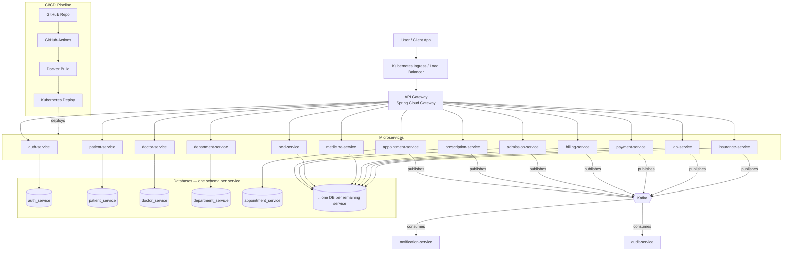

# System Architecture — Hospital Management System

## Notes

- Every business microservice owns its own PostgreSQL schema; there is no shared database.
- Cross-service reads happen over synchronous REST calls (e.g. billing-service calling patient-service to display a patient's name on an invoice).
- Cross-service side effects (notifications, audit trail) happen asynchronously over Kafka so that, for example, appointment-service never blocks on notification-service being available.
- The API Gateway is the single entry point; individual services are not exposed directly outside the cluster.
