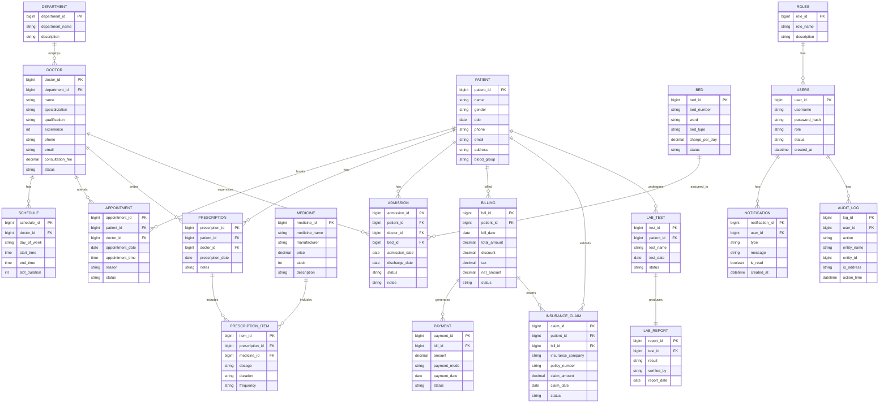

# ER Diagram — Hospital Management System

> **Note on microservice boundaries:** the FK arrows above describe the
> *logical* domain model shown in the source ER diagram. In the actual
> microservices implementation, each entity is owned by exactly one
> service's database, and cross-entity "relationships" that cross a
> service boundary (e.g. Appointment → Patient) are **not** JPA
> `@ManyToOne`/`@OneToMany` mappings — they are plain foreign-key `Long`
> columns, resolved via REST calls or Kafka events at runtime.
